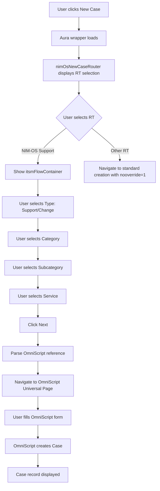

# CLAUDE.md - Salesforce ITSM New Case Override Project

## 🎯 PROJECT OVERVIEW

This Salesforce project implements a custom "New Case" button override that provides a guided ITSM (IT Service Management) experience. The solution routes users to different workflows based on their selected Record Type.

### Key Features
- Custom Record Type selection screen (bypasses standard Salesforce UI)
- Dynamic routing based on Record Type:
  - **NIM-OS Support** → Guided ITSM flow with OmniScript forms
  - **Other Record Types** → Standard Salesforce Case creation
- Service catalog integration with dynamic picklists
- OmniScript integration for complex form workflows

---

## 🏗️ ARCHITECTURE

### Technology Stack

| Layer | Technology | Purpose |
|-------|-----------|---------|
| **Override Wrapper** | Aura Component | Required for `lightning:actionOverride` (LWC can't implement this) |
| **UI Components** | Lightning Web Components (LWC) | Modern reactive components |
| **Business Logic** | Apex | Server-side data retrieval and processing |
| **Form Workflows** | OmniStudio OmniScripts | Guided form experiences |

### Component Structure

```
nimOsNewCaseOverride (Aura)
└── nimOsNewCaseRouter (LWC)
    ├── Record Type Selection
    └── itsmFlowContainer (LWC)
        ├── Service Selection (Type → Category → Subcategory → Service)
        └── NavigationMixin.Navigate() → OmniScript Universal Page
```

**Note**: `dynamicOmniscriptHost` component removed - using navigation instead of embedding to avoid cross-namespace issues.

---

## 📂 CODEBASE STRUCTURE

### Lightning Web Components

#### 1. `nimOsNewCaseRouter`
**Location**: `force-app/main/default/lwc/nimOsNewCaseRouter/`

**Purpose**: Main router component that displays Record Type selection and routes users

**Key Functionality**:
- Fetches available Record Types using `@wire(getObjectInfo)`
- Displays Record Type selection UI
- Routes to ITSM flow if RT = "NIM_OS_Support"
- Navigates to standard creation with `nooverride: '1'` for other RTs

**Important Files**:
- `nimOsNewCaseRouter.js` - Component logic
- `nimOsNewCaseRouter.html` - Template with RT selection
- `nimOsNewCaseRouter.css` - Styling for selection cards

**Key Variables**:
```javascript
NIMOS_SUPPORT_RT_DEVNAME = 'NIM_OS_Support'; // RT Developer Name to match
selectedRecordTypeId // Selected RT ID
selectedRecordTypeDeveloperName // Selected RT Developer Name
showRecordTypeSelection // Controls RT selection view
showItsmFlow // Controls ITSM flow view
```

#### 2. `itsmFlowContainer`
**Location**: `force-app/main/default/lwc/itsmFlowContainer/`

**Purpose**: Manages the ITSM service selection flow with cascading picklists

**Key Functionality**:
- Wire to `ITSMInitController.getITSMInitData()` to fetch services
- Cascading picklists: Type → Category → Subcategory → Service
- Parses Service Setup to extract OmniScript reference
- Launches OmniScript with correct parameters

**Data Flow**:
1. User selects **Type** (Support/Change)
2. User selects **Category** → Filters subcategories
3. User selects **Subcategory** → Filters services
4. User selects **Service** → Enables "Next"
5. Clicks "Next" → Parses OmniScript reference → Shows OmniScript

**OmniScript Reference Format**: `Type:SubType:Lang:Version`
- Example: `CaseSupport:ITSupport:EN:1`

#### 3. OmniScript Integration (via Navigation)

**NOTE**: This component was **removed** due to cross-namespace limitations.

**Current Approach**: Instead of embedding OmniScript, the system **navigates** to the standard OmniScript page.

**Why Navigation?**:
- ❌ LWC cannot reference cross-namespace components (omnistudio)
- ❌ LWC cannot call Aura components (only reverse works)
- ✅ Navigation avoids all cross-namespace issues
- ✅ Uses Salesforce standard OmniScript Universal Page

**Implementation**: See `itsmFlowContainer.js` → `navigateToOmniScript()` method

### Aura Component

#### `nimOsNewCaseOverride`
**Location**: `force-app/main/default/aura/nimOsNewCaseOverride/`

**Purpose**: Wrapper component for button override

**Why Aura?**: LWC cannot implement `lightning:actionOverride` interface

**Implementation**:
```xml
<aura:component implements="lightning:actionOverride,force:lightningQuickAction">
    <c:nimOsNewCaseRouter />
</aura:component>
```

---

## 🗄️ DATA MODEL

### Standard Objects

#### User
- `Division__c` (Text) - Links user to Account

#### Account
- `Legal_Name__c` (Text) - Matches User.Division__c

#### Product2 (Service Catalog)
- `Family` → **Category**
- `SubCategory__c` → **Subcategory**
- `IsActive` (Boolean) - Only active services shown
- Child: `Service_Setups__r` (Service_Setup__c)

### Custom Objects

#### Account_Service_Relationship__c (Junction Object)
**Purpose**: Links Accounts to available Services

Fields:
- `Account__c` (Lookup → Account)
- `Service__c` (Lookup → Product2)

#### Service_Setup__c
**Purpose**: Configures OmniScripts for each service

Fields:
- `Product2__c` (Lookup → Product2)
- `RelatedSupportForm__c` (Text) - Format: `Type:SubType:Lang:Version`
- `RelatedChangeForm__c` (Text) - Format: `Type:SubType:Lang:Version`

---

## 🔧 APEX CONTROLLER

### `ITSMInitController`
**Location**: `force-app/main/default/classes/ITSMInitController.cls`

**Purpose**: Retrieves all ITSM data for the current user

#### Main Method
```apex
@AuraEnabled(cacheable=true)
public static ResponseDTO getITSMInitData()
```

**Caching**: Uses `cacheable=true` for performance

#### Data Retrieval Flow
1. Get current User + Division
2. Find Account where `Legal_Name__c = User.Division__c`
3. Query Product2 via Account_Service_Relationship__c
4. Build hierarchical data structure

#### SOQL Query (Optimized)
```apex
SELECT Id, Name, Family, SubCategory__c,
       (SELECT Id, RelatedSupportForm__c, RelatedChangeForm__c
        FROM Service_Setups__r)
FROM Product2
WHERE Id IN (
    SELECT Service__c
    FROM Account_Service_Relationship__c
    WHERE Account__c = :accountId
)
AND IsActive = true
ORDER BY Family, SubCategory__c, Name
```

#### Response DTO Structure
```apex
{
    "categories": ["Category1", "Category2"],
    "subcategoriesByCategory": {
        "Category1": ["Subcat1", "Subcat2"]
    },
    "servicesByCatSubcat": {
        "Category1||Subcat1": [
            { "id": "01tXX", "name": "Service Name" }
        ]
    },
    "serviceSetups": [
        {
            "serviceId": "01tXX",
            "relatedSupportForm": "Type:SubType:Lang:Version"
        }
    ],
    "userDivision": "Division Name",
    "accountId": "001XX",
    "accountName": "Account Name"
}
```

---

## 🔄 USER FLOW

### Complete User Journey



**Note**: Step M uses `NavigationMixin.Navigate()` to redirect to `/apex/omnistudio__OmniScriptUniversalPage` instead of embedding the OmniScript.

### Event Chain

1. **Record Type Selection**
   - Event: `onclick={handleRecordTypeSelection}`
   - Updates: `selectedRecordTypeId`, `selectedRecordTypeDeveloperName`

2. **Next Button**
   - Event: `onclick={handleNext}`
   - Checks: `selectedRecordTypeDeveloperName === 'NIM_OS_Support'`
   - Action: Show `itsmFlowContainer` OR navigate to standard

3. **ITSM Flow Selection**
   - Events: `handleTypeChange`, `handleCategoryChange`, `handleSubcategoryChange`, `handleServiceChange`
   - Cascading updates to picklist options

4. **Launch OmniScript**
   - Event: `onclick={handleLaunchOmniScript}`
   - Parses OmniScript reference from Service Setup (Format: `Type:SubType:Lang:Version`)
   - Calls `navigateToOmniScript()` method
   - Navigates to `/apex/omnistudio__OmniScriptUniversalPage?params`

5. **OmniScript Completion**
   - User completes OmniScript on Universal Page
   - OmniScript creates Case
   - OmniScript handles navigation to Case (configured in OmniScript)

---

## 🔍 OMNISCRIPT INTEGRATION (via Navigation)

### Overview

**IMPORTANT CHANGE**: Due to cross-namespace limitations in LWC, OmniScripts are **NOT embedded** in the component. Instead, the system **navigates** to the OmniScript Universal Page.

### Why Navigation Instead of Embedding?

| Approach | Works? | Reason |
|----------|--------|--------|
| LWC → OmniStudio tag | ❌ | Cross-namespace error |
| LWC → Aura → OmniStudio | ❌ | LWC cannot call Aura |
| **Navigation to Universal Page** | ✅ | **No cross-namespace issues** |

### How It Works

When user clicks "Next" after service selection:

1. **Parse Reference**: Extract Type, SubType, Lang, Version from Service_Setup__c
   - Format: `CaseSupport:ITSupport:EN:1`

2. **Build URL**: Construct OmniScript Universal Page URL
   ```javascript
   const url = `/apex/omnistudio__OmniScriptUniversalPage?
       omniscriptType=CaseSupport&
       omniscriptSubType=ITSupport&
       omniscriptLang=EN&
       omniscriptVersion=1`;
   ```

3. **Navigate**: Use NavigationMixin to redirect
   ```javascript
   this[NavigationMixin.Navigate]({
       type: 'standard__webPage',
       attributes: { url: url }
   });
   ```

### Namespace Configuration

**CRITICAL**: Update the namespace in `itsmFlowContainer.js` line 201 if your org uses a different OmniStudio namespace.

#### Check Your Namespace
1. Navigate to: **Setup → Installed Packages**
2. Search for: "OmniStudio" or "Vlocity"
3. Note the namespace prefix

#### Common Namespaces

| Namespace | VF Page |
|-----------|---------|
| `omnistudio` (default) | `/apex/omnistudio__OmniScriptUniversalPage` |
| `vlocity_cmt` | `/apex/vlocity_cmt__OmniScriptUniversalPage` |
| `vlocity_ins` | `/apex/vlocity_ins__OmniScriptUniversalPage` |

#### Update Code

**File**: `force-app/main/default/lwc/itsmFlowContainer/itsmFlowContainer.js`

**Line 201**:
```javascript
const omniscriptUrl = `/apex/omnistudio__OmniScriptUniversalPage?` + // ← Change namespace here
```

### URL Parameters

| Parameter | Description | Example |
|-----------|-------------|---------|
| `omniscriptType` | OmniScript Type | `CaseSupport` |
| `omniscriptSubType` | OmniScript SubType | `ITSupport` |
| `omniscriptLang` | Language code | `EN` |
| `omniscriptVersion` | Version number | `1` |

### User Experience

1. User completes service selection in `itsmFlowContainer`
2. Clicks "Next"
3. **Browser navigates** to OmniScript page (leaves ITSM selection page)
4. User completes OmniScript form
5. OmniScript creates Case
6. OmniScript redirects to Case (configured in OmniScript settings)

---

## ⚙️ CONFIGURATION & DEPLOYMENT

### Prerequisites

1. **OmniStudio** must be installed in your org
2. **Custom Objects** must be created:
   - `Account_Service_Relationship__c`
   - `Service_Setup__c`
3. **Custom Fields** must be added:
   - `User.Division__c`
   - `Account.Legal_Name__c`
   - `Product2.SubCategory__c`

### Deployment Steps

#### 1. Deploy Apex Class
```bash
sf project deploy start --source-path force-app/main/default/classes/ITSMInitController.cls
```

#### 2. Deploy LWC Components
```bash
sf project deploy start --source-path force-app/main/default/lwc/
```

#### 3. Deploy Aura Component
```bash
sf project deploy start --source-path force-app/main/default/aura/nimOsNewCaseOverride/
```

#### 4. Configure Button Override

**Manual Steps**:
1. Navigate to: **Setup → Object Manager → Case → Buttons, Links, and Actions**
2. Edit the **New** button
3. Override with: **Lightning Component** → `c:nimOsNewCaseOverride`
4. Save

#### 5. Assign Permissions

Ensure users have:
- Read access to: Account, Product2, Service_Setup__c, Account_Service_Relationship__c
- Field-level access to: User.Division__c, Account.Legal_Name__c

#### 6. Update OmniScript Namespace (if needed)

**File**: `force-app/main/default/lwc/itsmFlowContainer/itsmFlowContainer.js`

Edit line 201 if your org uses a different namespace:
```javascript
const omniscriptUrl = `/apex/omnistudio__OmniScriptUniversalPage?` + // ← Change namespace
```

---

## 🧪 TESTING GUIDE

### Unit Tests

Currently **no test classes** are included in the repository.

**Recommended Test Coverage**:
1. `ITSMInitController_Test.cls` - Test Apex logic
2. LWC Jest tests (already scaffolded in `__tests__` folders)

### Manual Testing Checklist

#### Test Case 1: Record Type Selection
- [ ] Click "New Case" button
- [ ] Verify all available RTs display
- [ ] Select each RT
- [ ] Verify selected state visually updates

#### Test Case 2: NIM-OS Support Flow
- [ ] Select "NIM-OS Support" RT
- [ ] Click "Next"
- [ ] Verify ITSM flow displays
- [ ] Select Support type
- [ ] Verify Category picklist populates
- [ ] Select Category
- [ ] Verify Subcategory picklist filters correctly
- [ ] Select Subcategory
- [ ] Verify Service picklist filters correctly
- [ ] Click "Next" → OmniScript should display

#### Test Case 3: Other Record Types
- [ ] Select any non-NIM-OS RT
- [ ] Click "Next"
- [ ] Verify navigation to standard Case creation
- [ ] Verify no infinite loop (nooverride works)

#### Test Case 4: OmniScript Navigation
- [ ] Complete the ITSM flow to launch OmniScript
- [ ] **Verify browser navigates** to `/apex/omnistudio__OmniScriptUniversalPage`
- [ ] Verify URL contains correct parameters (type, subType, lang, version)
- [ ] Verify OmniScript displays on Universal Page
- [ ] Fill out OmniScript form
- [ ] Submit OmniScript
- [ ] Verify Case is created
- [ ] Verify navigation to new Case record (configured in OmniScript)

#### Test Case 5: Error Handling
- [ ] User with no Division → Should show error
- [ ] User with no matching Account → Should show error
- [ ] Service with no Service Setup → Should show error

### Debug Mode

All components include extensive `console.log` statements:
- Look for emojis: 🔵 (info), ✅ (success), ❌ (error), 📍 (data)
- Open browser DevTools Console during testing

---

## 🐛 TROUBLESHOOTING

### Common Issues

#### 1. OmniScript Not Displaying

**Symptoms**: Blank screen after clicking "Next" in ITSM flow

**Causes**:
- Wrong namespace in `dynamicOmniscriptHost.html`
- OmniScript not activated/deployed
- Incorrect OmniScript reference format

**Solutions**:
1. Verify namespace: Setup → Installed Packages
2. Update `<omnistudio-omniscript-step>` tag
3. Check OmniScript is Active in OmniStudio
4. Verify Service_Setup__c field format: `Type:SubType:Lang:Version`

#### 2. Infinite Loop on Standard Case Creation

**Symptoms**: Clicking "Next" for non-NIM-OS RT loops back

**Cause**: Missing `nooverride: '1'` parameter

**Solution**: Verify in `nimOsNewCaseRouter.js:140`:
```javascript
state: {
    recordTypeId: this.selectedRecordTypeId,
    nooverride: '1'  // CRITICAL
}
```

#### 3. No Services Display

**Symptoms**: Empty picklists in ITSM flow

**Causes**:
- User has no Division
- No Account matches Division
- No Account_Service_Relationship__c records
- All Product2 records are IsActive = false

**Solutions**:
1. Check User.Division__c is populated
2. Create Account with matching Legal_Name__c
3. Create Account_Service_Relationship__c records
4. Ensure Product2.IsActive = true

#### 4. Record Types Not Showing

**Symptoms**: Spinner forever or "No Record Types available"

**Causes**:
- User profile doesn't have RT access
- All RTs are Master
- Wire service error

**Solutions**:
1. Verify Profile → Record Type Settings
2. Check browser console for errors
3. Verify Case object permissions

---

## 📊 PERFORMANCE CONSIDERATIONS

### Caching

The `ITSMInitController.getITSMInitData()` method uses `@AuraEnabled(cacheable=true)`.

**Cache Behavior**:
- Data is cached client-side for the session
- Refreshes on browser refresh
- Invalidates when user changes

**Implications**:
- Very fast initial load
- Changes to Service_Setup__c require page refresh to see
- Good for read-heavy workflows

### SOQL Optimization

The Apex query is **optimized** with:
- Single query for all services
- Subquery for Service_Setups (no N+1 queries)
- WHERE clause filters before data retrieval
- ORDER BY for consistent user experience

**Governor Limits**:
- Max 1 SOQL query per call
- Efficient for orgs with hundreds of services

### LWC Best Practices

- Uses `@wire` for reactive data
- `@track` only where needed (reactive properties)
- Event bubbling with `composed: true`
- Conditional rendering (`if:true`/`if:false`)

---

## 🔐 SECURITY CONSIDERATIONS

### Sharing & Visibility

- Apex class uses `with sharing` - respects user's record access
- OmniScript runs in user context
- Service visibility controlled via Account_Service_Relationship__c

### Field-Level Security

Required field access:
- User: Division__c
- Account: Legal_Name__c
- Product2: Family, SubCategory__c, IsActive
- Service_Setup__c: RelatedSupportForm__c, RelatedChangeForm__c

### Input Validation

The code includes validation:
- OmniScript reference format validation (must be `X:X:X:X`)
- Required field checks before launching OmniScript
- Empty state handling

**Potential XSS Risk**: OmniScript parameters are passed directly. Ensure Service_Setup__c fields are admin-managed, not user-editable.

---

## 🚀 FUTURE ENHANCEMENTS

### Recommended Improvements

1. **Test Coverage**
   - Add `ITSMInitController_Test.cls`
   - Complete LWC Jest tests
   - Aim for 85%+ coverage

2. **Error Handling**
   - Custom error messages for each failure scenario
   - Retry logic for OmniScript load failures
   - User-friendly error UI

3. **Analytics**
   - Track which services are most requested
   - Monitor OmniScript completion rates
   - Dashboard for ITSM metrics

4. **Internationalization**
   - Multi-language support for UI labels
   - Dynamic OmniScript language selection based on User.LanguageLocaleKey

5. **Mobile Optimization**
   - Test on Salesforce Mobile App
   - Responsive design improvements

6. **Accessibility**
   - ARIA labels for screen readers
   - Keyboard navigation support
   - High contrast mode compatibility

---

## 📝 DEVELOPMENT WORKFLOWS

### Making Changes

#### Adding a New Record Type Flow

1. **No code change needed** if routing to standard creation
2. To add custom flow for new RT:
   - Update `NIMOS_SUPPORT_RT_DEVNAME` or add new condition in `handleNext()`
   - Create new LWC container if needed

#### Modifying Service Picklists

Data is driven by:
- Product2 (Family, SubCategory__c)
- Account_Service_Relationship__c (visibility)

**No code changes needed** - update data in Salesforce UI.

#### Adding New OmniScript Parameters

1. Add `@api` property to `dynamicOmniscriptHost.js`
2. Pass from `itsmFlowContainer.html`
3. Bind to `<omnistudio-omniscript-step>` in HTML

### Code Review Checklist

Before committing changes:
- [ ] All console.log statements use emoji prefixes
- [ ] Error handling includes user-friendly messages
- [ ] Navigation uses `nooverride: '1'` where needed
- [ ] No hard-coded IDs (use Developer Names)
- [ ] CSS follows SLDS naming conventions
- [ ] XML metadata has correct API version (65.0+)

### Git Workflow

Current branch: `claude/claude-md-mi05n8egldlhq9qn-01YK6bTa9355fo9W8UpGnc5U`

**Commit Messages** should follow format:
```
feat: Add OmniScript integration to dynamicOmniscriptHost
fix: Prevent infinite loop with nooverride parameter
docs: Update CLAUDE.md with namespace instructions
```

---

## 🤝 AI ASSISTANT GUIDELINES

### When Working on This Codebase

1. **Always check CLAUDE.md first** for architecture understanding
2. **Namespace awareness**: Never hard-code OmniStudio namespaces
3. **Governor limits**: Keep SOQL queries efficient
4. **Event propagation**: Use `bubbles: true, composed: true` for cross-shadow-DOM events
5. **Navigation**: Always use `NavigationMixin`, never window.location

### Common AI Tasks

#### "Add a new field to the ITSM flow"
1. Check if it's in Product2 (read Apex)
2. If custom, update `ITSMInitController` SOQL
3. Update DTO classes
4. Update LWC to display new field

#### "Fix OmniScript not loading"
1. Check namespace in `dynamicOmniscriptHost.html`
2. Verify Service_Setup__c field format
3. Check browser console for errors
4. Verify OmniScript is activated

#### "Change Record Type logic"
1. Edit `nimOsNewCaseRouter.js` → `handleNext()`
2. Update `NIMOS_SUPPORT_RT_DEVNAME` constant
3. Test both RT paths

### Tools & Resources

- **Salesforce CLI**: `sf` command (preferred over `sfdx`)
- **API Version**: 65.0
- **LWC Docs**: https://developer.salesforce.com/docs/component-library/overview/components
- **OmniStudio Docs**: Check installed package version

---

## 📋 KEY FILES REFERENCE

| File | Lines | Purpose |
|------|-------|---------|
| `nimOsNewCaseRouter.js` | 234 | Main routing logic |
| `itsmFlowContainer.js` | 311 | Service selection flow |
| `dynamicOmniscriptHost.js` | 62 | OmniScript host |
| `dynamicOmniscriptHost.html` | 24 | OmniScript embed (**CRITICAL: Update namespace**) |
| `ITSMInitController.cls` | 227 | Apex data retrieval |
| `nimOsNewCaseOverride.cmp` | 17 | Aura wrapper |

---

## ✅ FINAL DEPLOYMENT CHECKLIST

Before going to Production:

- [ ] Determine OmniStudio namespace (Setup → Installed Packages)
- [ ] Update `dynamicOmniscriptHost.html` with correct namespace
- [ ] Deploy all components to Sandbox
- [ ] Configure "New" button override
- [ ] Test all Record Type paths
- [ ] Test ITSM flow end-to-end
- [ ] Verify OmniScript creates Case successfully
- [ ] Test with different user profiles
- [ ] Test on mobile (Salesforce app)
- [ ] Create test users with different Divisions
- [ ] Verify error handling (user with no Division, etc.)
- [ ] Add Apex test class (85%+ coverage)
- [ ] Document deployment in change log
- [ ] Train end users
- [ ] Deploy to Production
- [ ] Monitor for errors in first week

---

## 📞 SUPPORT & CONTACT

### Issue Reporting

When reporting issues, include:
1. User profile and Division
2. Selected Record Type
3. Browser console output (with emoji-prefixed logs)
4. Screenshot of error
5. Steps to reproduce

### Maintenance

**Regular Checks**:
- Monitor Case creation success rates
- Review OmniScript completion analytics
- Update Service_Setup__c for new OmniScripts
- Keep Product2 catalog current

---

**Last Updated**: 2025-11-15
**Project Version**: 1.0
**Salesforce API Version**: 65.0
**Status**: ✅ Ready for Deployment (pending namespace update)
