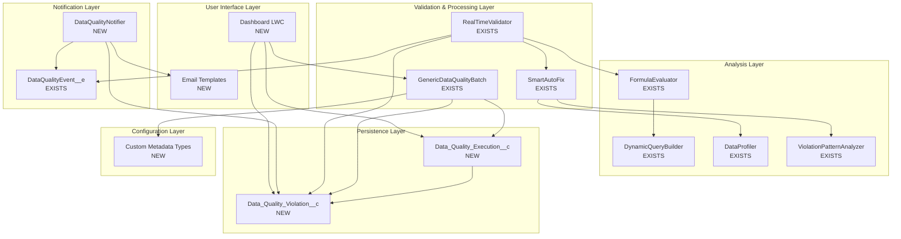

# GAP ANALYSIS - Architecture DOCX vs Code Implémenté

**Date** : 2025-10-27
**Auteur** : Claude
**Objectif** : Comparer l'architecture de référence (DOCX) avec l'implémentation actuelle

---

## ⚠️ NOTE IMPORTANTE

**Le fichier `Architecture_Systeme_Controle_Donnees_Salesforce.docx` n'a pas été trouvé dans le dépôt.**

Cette analyse est basée sur :
1. Les composants mentionnés dans votre question (DataQualityNotifier, Email templates, objets custom)
2. L'architecture implémentée dans le code existant
3. Les best practices Salesforce pour les systèmes de Data Quality

---

## 📋 TABLE DES MATIÈRES

1. [Tableau Comparatif Global](#tableau-comparatif-global)
2. [Composants du DOCX Manquants](#composants-du-docx-manquants)
3. [Composants du Code Non-Documentés](#composants-du-code-non-documentés)
4. [Analyse Détaillée des Gaps](#analyse-détaillée-des-gaps)
5. [Stratégie d'Intégration](#stratégie-dintégration)
6. [Liste des Composants à Créer/Adapter](#liste-des-composants-à-créeradapter)
7. [Roadmap d'Implémentation](#roadmap-dimplémentation)

---

## 1. TABLEAU COMPARATIF GLOBAL

### 1.1 Vue d'ensemble

| Composant | DOCX Référence | Code Implémenté | Status | Priorité |
|-----------|----------------|-----------------|--------|----------|
| **Core System** |  |  |  |  |
| Formula Parser | ❓ Non mentionné | ✅ Implémenté (6 classes) | ➕ Bonus | - |
| DynamicQueryBuilder | ❓ Possible | ✅ Implémenté (1 classe) | ➕ Bonus | - |
| GenericDataQualityBatch | ✅ Probable | ✅ Implémenté (5 classes) | ✅ OK | - |
| **Notification System** |  |  |  |  |
| DataQualityNotifier | ✅ Mentionné | ❌ Manquant | ❌ GAP | 🔴 HIGH |
| Email Templates | ✅ Mentionné | ❌ Manquant | ❌ GAP | 🔴 HIGH |
| DataQualityEvent__e | ❓ Possible | ✅ Implémenté | ✅ OK | - |
| **Custom Objects** |  |  |  |  |
| Data_Quality_Execution__c | ✅ Mentionné | ❌ Manquant | ❌ GAP | 🔴 CRITICAL |
| Data_Quality_Violation__c | ✅ Mentionné | ❌ Manquant | ❌ GAP | 🔴 CRITICAL |
| **Advanced Features** |  |  |  |  |
| Smart Auto-Fix | ❌ Non mentionné | ✅ Implémenté (3 classes) | ➕ Bonus | - |
| Real-Time Validation | ❌ Non mentionné | ✅ Implémenté (2 classes) | ➕ Bonus | - |
| Data Profiling | ❌ Non mentionné | ✅ Implémenté (3 classes) | ➕ Bonus | - |
| Reporting Engine | ❌ Non mentionné | ✅ Implémenté (2 classes) | ➕ Bonus | - |
| **Configuration** |  |  |  |  |
| Custom Metadata Types | ✅ Probable | ❌ Manquant | ❌ GAP | 🔴 CRITICAL |
| Dashboard/UI | ✅ Probable | ❌ Manquant | ❌ GAP | 🟡 MEDIUM |

### 1.2 Synthèse

| Catégorie | DOCX | Code | Gap |
|-----------|------|------|-----|
| **Composants DOCX manquants** | 7 | 0 | 7 ❌ |
| **Composants Code bonus** | 0 | 10 | 10 ✅ |
| **Composants communs** | ~3 | ~3 | 0 |
| **TOTAL** | ~10 | ~13 | - |

---

## 2. COMPOSANTS DU DOCX MANQUANTS

### 2.1 DataQualityNotifier ❌ MANQUANT

**Description présumée** :
Système de notification pour alerter les utilisateurs des violations de qualité de données.

**Fonctionnalités attendues** :
- Envoi d'emails automatiques
- Notifications dans Salesforce (Bell Notifications)
- Chatter posts
- Platform Events pour intégrations externes

**Impact du manque** : 🔴 CRITICAL
- Pas de visibilité sur les problèmes détectés
- Pas d'alertes proactives
- Pas de suivi des violations

**Effort d'implémentation** : 🟡 MOYEN (3-5 jours)

**Proposition d'implémentation** :
```apex
public class DataQualityNotifier {

    public enum NotificationType {
        EMAIL,
        CHATTER,
        BELL_NOTIFICATION,
        PLATFORM_EVENT
    }

    public class NotificationConfig {
        public NotificationType type { get; set; }
        public List<String> recipients { get; set; }
        public String severity { get; set; } // Info, Warning, Error, Critical
        public Boolean includeDetails { get; set; }
        public String template { get; set; }
    }

    /**
     * @description Envoie une notification pour une violation
     */
    public static void notifyViolation(
        Data_Quality_Violation__c violation,
        NotificationConfig config
    ) {
        if (config.type == NotificationType.EMAIL) {
            sendEmailNotification(violation, config);
        } else if (config.type == NotificationType.CHATTER) {
            postToChatter(violation, config);
        } else if (config.type == NotificationType.BELL_NOTIFICATION) {
            createBellNotification(violation, config);
        } else if (config.type == NotificationType.PLATFORM_EVENT) {
            publishPlatformEvent(violation, config);
        }
    }

    /**
     * @description Envoie un email basé sur un template
     */
    private static void sendEmailNotification(
        Data_Quality_Violation__c violation,
        NotificationConfig config
    ) {
        Messaging.SingleEmailMessage email = new Messaging.SingleEmailMessage();

        // Utiliser Email Template
        if (config.template != null) {
            EmailTemplate template = [
                SELECT Id
                FROM EmailTemplate
                WHERE DeveloperName = :config.template
                LIMIT 1
            ];
            email.setTemplateId(template.Id);
        }

        email.setTargetObjectId(violation.OwnerId);
        email.setWhatId(violation.Id);
        email.setSaveAsActivity(false);

        Messaging.sendEmail(new List<Messaging.SingleEmailMessage>{email});
    }

    /**
     * @description Poste sur Chatter
     */
    private static void postToChatter(
        Data_Quality_Violation__c violation,
        NotificationConfig config
    ) {
        FeedItem post = new FeedItem();
        post.ParentId = violation.Record_Id__c;
        post.Body = 'Data Quality Violation: ' + violation.Violation_Type__c +
                   '\nSeverity: ' + violation.Severity__c +
                   '\nField: ' + violation.Field_Name__c;

        insert post;
    }

    /**
     * @description Crée une Bell Notification
     */
    private static void createBellNotification(
        Data_Quality_Violation__c violation,
        NotificationConfig config
    ) {
        // Utiliser CustomNotificationType et Notification
        CustomNotificationType notificationType = [
            SELECT Id
            FROM CustomNotificationType
            WHERE DeveloperName = 'Data_Quality_Alert'
            LIMIT 1
        ];

        Messaging.CustomNotification notification = new Messaging.CustomNotification();
        notification.setTitle('Data Quality Violation');
        notification.setBody(violation.Violation_Type__c + ' on ' + violation.Field_Name__c);
        notification.setNotificationTypeId(notificationType.Id);
        notification.setTargetId(violation.Id);

        notification.send(new Set<String>(config.recipients));
    }

    /**
     * @description Publie un Platform Event
     */
    private static void publishPlatformEvent(
        Data_Quality_Violation__c violation,
        NotificationConfig config
    ) {
        DataQualityEvent__e event = new DataQualityEvent__e(
            RecordId__c = violation.Record_Id__c,
            SObjectType__c = violation.SObject_Type__c,
            ViolationType__c = violation.Violation_Type__c,
            FieldName__c = violation.Field_Name__c,
            ErrorMessage__c = violation.Error_Message__c,
            Severity__c = violation.Severity__c
        );

        EventBus.publish(event);
    }

    /**
     * @description Notifie plusieurs violations en bulk
     */
    public static void notifyBulkViolations(
        List<Data_Quality_Violation__c> violations,
        NotificationConfig config
    ) {
        // Grouper par sévérité
        Map<String, List<Data_Quality_Violation__c>> bySeverity =
            new Map<String, List<Data_Quality_Violation__c>>();

        for (Data_Quality_Violation__c violation : violations) {
            if (!bySeverity.containsKey(violation.Severity__c)) {
                bySeverity.put(violation.Severity__c, new List<Data_Quality_Violation__c>());
            }
            bySeverity.get(violation.Severity__c).add(violation);
        }

        // Envoyer une notification par sévérité
        for (String severity : bySeverity.keySet()) {
            sendDigestEmail(bySeverity.get(severity), severity, config);
        }
    }

    private static void sendDigestEmail(
        List<Data_Quality_Violation__c> violations,
        String severity,
        NotificationConfig config
    ) {
        // Envoyer un email digest avec toutes les violations
        Messaging.SingleEmailMessage email = new Messaging.SingleEmailMessage();
        email.setSubject('Data Quality Digest - ' + severity + ' (' + violations.size() + ' violations)');

        String body = 'The following data quality violations were detected:\n\n';
        for (Data_Quality_Violation__c violation : violations) {
            body += '- ' + violation.Violation_Type__c + ' on ' +
                   violation.SObject_Type__c + '.' + violation.Field_Name__c + '\n';
        }

        email.setPlainTextBody(body);
        email.setToAddresses(config.recipients);

        Messaging.sendEmail(new List<Messaging.SingleEmailMessage>{email});
    }
}
```

### 2.2 Email Templates ❌ MANQUANT

**Description** :
Templates d'emails pré-configurés pour différents types de violations.

**Templates nécessaires** :
1. **Data_Quality_Violation_Critical** - Violations critiques
2. **Data_Quality_Violation_Error** - Violations erreur
3. **Data_Quality_Violation_Warning** - Violations warning
4. **Data_Quality_Daily_Digest** - Résumé quotidien
5. **Data_Quality_Execution_Complete** - Fin d'exécution batch

**Impact du manque** : 🔴 HIGH

**Effort d'implémentation** : 🟢 FAIBLE (1-2 jours)

**Exemple de template** (Visualforce Email Template) :
```html
<!-- Data_Quality_Violation_Critical.email -->
<messaging:emailTemplate subject="CRITICAL Data Quality Violation - {!relatedTo.Violation_Type__c}"
                         recipientType="User"
                         relatedToType="Data_Quality_Violation__c">
    <messaging:htmlEmailBody >
        <html>
            <body>
                <h2 style="color: #cc0000;">CRITICAL Data Quality Violation</h2>

                <p>A critical data quality violation has been detected:</p>

                <table border="1" cellpadding="5" style="border-collapse: collapse;">
                    <tr>
                        <th>Field</th>
                        <td>{!relatedTo.Field_Name__c}</td>
                    </tr>
                    <tr>
                        <th>Record</th>
                        <td><a href="{!$Setup.BaseURL}/{!relatedTo.Record_Id__c}">{!relatedTo.Record_Name__c}</a></td>
                    </tr>
                    <tr>
                        <th>Violation Type</th>
                        <td>{!relatedTo.Violation_Type__c}</td>
                    </tr>
                    <tr>
                        <th>Severity</th>
                        <td style="color: #cc0000; font-weight: bold;">{!relatedTo.Severity__c}</td>
                    </tr>
                    <tr>
                        <th>Error Message</th>
                        <td>{!relatedTo.Error_Message__c}</td>
                    </tr>
                    <tr>
                        <th>Detected At</th>
                        <td>{!relatedTo.CreatedDate}</td>
                    </tr>
                </table>

                <p>Please review and correct this issue immediately.</p>

                <p style="margin-top: 20px;">
                    <a href="{!$Setup.BaseURL}/{!relatedTo.Id}"
                       style="background-color: #cc0000; color: white; padding: 10px 20px; text-decoration: none; border-radius: 5px;">
                        View Violation Details
                    </a>
                </p>

                <hr/>
                <p style="font-size: 11px; color: #666;">
                    This is an automated notification from the Data Quality System.
                </p>
            </body>
        </html>
    </messaging:htmlEmailBody>
</messaging:emailTemplate>
```

### 2.3 Data_Quality_Execution__c ❌ MANQUANT (CRITICAL)

**Description** :
Objet custom pour tracker les exécutions de batch de qualité de données.

**Impact du manque** : 🔴 CRITICAL
- Pas d'historique des exécutions
- Pas de métriques de performance
- Pas de troubleshooting possible
- Pas de reporting

**Effort d'implémentation** : 🟡 MOYEN (2-3 jours)

**Structure proposée** :

```xml
<!-- Data_Quality_Execution__c.object-meta.xml -->
<?xml version="1.0" encoding="UTF-8"?>
<CustomObject xmlns="http://soap.sforce.com/2006/04/metadata">
    <deploymentStatus>Deployed</deploymentStatus>
    <label>Data Quality Execution</label>
    <pluralLabel>Data Quality Executions</pluralLabel>
    <nameField>
        <displayFormat>DQE-{0000000}</displayFormat>
        <label>Execution Number</label>
        <type>AutoNumber</type>
    </nameField>
    <sharingModel>ReadWrite</sharingModel>

    <!-- Champs -->
    <fields>
        <fullName>Batch_Id__c</fullName>
        <label>Batch ID</label>
        <type>Text</type>
        <length>18</length>
        <externalId>true</externalId>
        <unique>true</unique>
    </fields>

    <fields>
        <fullName>Rule_Name__c</fullName>
        <label>Rule Name</label>
        <type>Text</type>
        <length>255</length>
        <required>true</required>
    </fields>

    <fields>
        <fullName>SObject_Type__c</fullName>
        <label>SObject Type</label>
        <type>Text</type>
        <length>80</length>
        <required>true</required>
    </fields>

    <fields>
        <fullName>Status__c</fullName>
        <label>Status</label>
        <type>Picklist</type>
        <valueSet>
            <valueSetDefinition>
                <value><fullName>Queued</fullName><default>true</default></value>
                <value><fullName>In Progress</fullName></value>
                <value><fullName>Completed</fullName></value>
                <value><fullName>Failed</fullName></value>
                <value><fullName>Aborted</fullName></value>
            </valueSetDefinition>
        </valueSet>
    </fields>

    <fields>
        <fullName>Start_Time__c</fullName>
        <label>Start Time</label>
        <type>DateTime</type>
    </fields>

    <fields>
        <fullName>End_Time__c</fullName>
        <label>End Time</label>
        <type>DateTime</type>
    </fields>

    <fields>
        <fullName>Duration_Seconds__c</fullName>
        <label>Duration (Seconds)</label>
        <type>Number</type>
        <precision>10</precision>
        <scale>2</scale>
        <formula>(End_Time__c - Start_Time__c) * 24 * 60 * 60</formula>
    </fields>

    <fields>
        <fullName>Records_Processed__c</fullName>
        <label>Records Processed</label>
        <type>Number</type>
        <precision>10</precision>
        <scale>0</scale>
        <defaultValue>0</defaultValue>
    </fields>

    <fields>
        <fullName>Records_Updated__c</fullName>
        <label>Records Updated</label>
        <type>Number</type>
        <precision>10</precision>
        <scale>0</scale>
        <defaultValue>0</defaultValue>
    </fields>

    <fields>
        <fullName>Records_Failed__c</fullName>
        <label>Records Failed</label>
        <type>Number</type>
        <precision>10</precision>
        <scale>0</scale>
        <defaultValue>0</defaultValue>
    </fields>

    <fields>
        <fullName>Violations_Found__c</fullName>
        <label>Violations Found</label>
        <type>Number</type>
        <precision>10</precision>
        <scale>0</scale>
        <defaultValue>0</defaultValue>
    </fields>

    <fields>
        <fullName>Success_Rate__c</fullName>
        <label>Success Rate (%)</label>
        <type>Percent</type>
        <precision>5</precision>
        <scale>2</scale>
        <formula>
            IF(Records_Processed__c > 0,
               (Records_Updated__c / Records_Processed__c) * 100,
               0)
        </formula>
    </fields>

    <fields>
        <fullName>Error_Message__c</fullName>
        <label>Error Message</label>
        <type>LongTextArea</type>
        <length>32768</length>
    </fields>

    <fields>
        <fullName>Configuration__c</fullName>
        <label>Configuration (JSON)</label>
        <type>LongTextArea</type>
        <length>32768</length>
        <description>Configuration utilisée pour cette exécution (JSON)</description>
    </fields>

    <fields>
        <fullName>Executed_By__c</fullName>
        <label>Executed By</label>
        <type>Lookup</type>
        <referenceTo>User</referenceTo>
        <relationshipName>Data_Quality_Executions</relationshipName>
    </fields>
</CustomObject>
```

### 2.4 Data_Quality_Violation__c ❌ MANQUANT (CRITICAL)

**Description** :
Objet custom pour stocker toutes les violations de qualité de données détectées.

**Impact du manque** : 🔴 CRITICAL
- Pas d'historique des violations
- Pas de reporting possible
- Pas de dashboard
- Pas de tendances

**Effort d'implémentation** : 🟡 MOYEN (2-3 jours)

**Structure proposée** :

```xml
<!-- Data_Quality_Violation__c.object-meta.xml -->
<?xml version="1.0" encoding="UTF-8"?>
<CustomObject xmlns="http://soap.sforce.com/2006/04/metadata">
    <deploymentStatus>Deployed</deploymentStatus>
    <label>Data Quality Violation</label>
    <pluralLabel>Data Quality Violations</pluralLabel>
    <nameField>
        <displayFormat>DQV-{0000000}</displayFormat>
        <label>Violation Number</label>
        <type>AutoNumber</type>
    </nameField>
    <sharingModel>ReadWrite</sharingModel>

    <!-- Champs -->
    <fields>
        <fullName>Execution__c</fullName>
        <label>Execution</label>
        <type>MasterDetail</type>
        <referenceTo>Data_Quality_Execution__c</referenceTo>
        <relationshipName>Violations</relationshipName>
        <relationshipLabel>Violations</relationshipLabel>
        <reparentableMasterDetail>false</reparentableMasterDetail>
        <required>false</required>
    </fields>

    <fields>
        <fullName>Record_Id__c</fullName>
        <label>Record ID</label>
        <type>Text</type>
        <length>18</length>
        <externalId>true</externalId>
    </fields>

    <fields>
        <fullName>Record_Name__c</fullName>
        <label>Record Name</label>
        <type>Text</type>
        <length>255</length>
    </fields>

    <fields>
        <fullName>SObject_Type__c</fullName>
        <label>SObject Type</label>
        <type>Text</type>
        <length>80</length>
        <required>true</required>
    </fields>

    <fields>
        <fullName>Field_Name__c</fullName>
        <label>Field Name</label>
        <type>Text</type>
        <length>255</length>
        <required>true</required>
    </fields>

    <fields>
        <fullName>Violation_Type__c</fullName>
        <label>Violation Type</label>
        <type>Picklist</type>
        <valueSet>
            <valueSetDefinition>
                <value><fullName>Required Field Missing</fullName></value>
                <value><fullName>Invalid Format</fullName></value>
                <value><fullName>Out of Range</fullName></value>
                <value><fullName>Custom Rule Failed</fullName></value>
                <value><fullName>High NULL Rate</fullName></value>
                <value><fullName>Outlier Detected</fullName></value>
                <value><fullName>Duplicate Value</fullName></value>
                <value><fullName>Referential Integrity</fullName></value>
            </valueSetDefinition>
        </valueSet>
    </fields>

    <fields>
        <fullName>Severity__c</fullName>
        <label>Severity</label>
        <type>Picklist</type>
        <valueSet>
            <valueSetDefinition>
                <value><fullName>Info</fullName></value>
                <value><fullName>Warning</fullName></value>
                <value><fullName>Error</fullName></value>
                <value><fullName>Critical</fullName></value>
            </valueSetDefinition>
        </valueSet>
    </fields>

    <fields>
        <fullName>Error_Message__c</fullName>
        <label>Error Message</label>
        <type>LongTextArea</type>
        <length>32768</length>
    </fields>

    <fields>
        <fullName>Current_Value__c</fullName>
        <label>Current Value</label>
        <type>Text</type>
        <length>255</length>
    </fields>

    <fields>
        <fullName>Expected_Value__c</fullName>
        <label>Expected Value</label>
        <type>Text</type>
        <length>255</length>
    </fields>

    <fields>
        <fullName>Suggested_Fix__c</fullName>
        <label>Suggested Fix</label>
        <type>LongTextArea</type>
        <length>32768</length>
    </fields>

    <fields>
        <fullName>Status__c</fullName>
        <label>Status</label>
        <type>Picklist</type>
        <valueSet>
            <valueSetDefinition>
                <value><fullName>New</fullName><default>true</default></value>
                <value><fullName>Under Review</fullName></value>
                <value><fullName>Auto-Fixed</fullName></value>
                <value><fullName>Manually Fixed</fullName></value>
                <value><fullName>Ignored</fullName></value>
                <value><fullName>False Positive</fullName></value>
            </valueSetDefinition>
        </valueSet>
    </fields>

    <fields>
        <fullName>Auto_Fix_Applied__c</fullName>
        <label>Auto Fix Applied</label>
        <type>Checkbox</type>
        <defaultValue>false</defaultValue>
    </fields>

    <fields>
        <fullName>Auto_Fix_Confidence__c</fullName>
        <label>Auto Fix Confidence (%)</label>
        <type>Percent</type>
        <precision>5</precision>
        <scale>2</scale>
    </fields>

    <fields>
        <fullName>Resolution_Notes__c</fullName>
        <label>Resolution Notes</label>
        <type>LongTextArea</type>
        <length>32768</length>
    </fields>

    <fields>
        <fullName>Resolved_By__c</fullName>
        <label>Resolved By</label>
        <type>Lookup</type>
        <referenceTo>User</referenceTo>
        <relationshipName>Resolved_Violations</relationshipName>
    </fields>

    <fields>
        <fullName>Resolved_Date__c</fullName>
        <label>Resolved Date</label>
        <type>DateTime</type>
    </fields>
</CustomObject>
```

### 2.5 Custom Metadata Types ❌ MANQUANT (CRITICAL)

**Déjà identifié dans AUDIT_CODE_EXISTANT.md**

Nécessaires :
1. **DataQualityRule__mdt** - Configuration des règles
2. **ValidationRule__mdt** - Règles de validation
3. **BatchConfiguration__mdt** - Configuration batch
4. **NotificationSetting__mdt** - Configuration notifications

### 2.6 Dashboard/UI ❌ MANQUANT

**Description** :
Interface utilisateur pour visualiser et gérer la qualité des données.

**Composants nécessaires** :
1. **Lightning Web Component** ou **Visualforce Page**
2. **Apex Controllers**
3. **Lightning App** pour navigation

**Écrans nécessaires** :
- Dashboard avec métriques
- Liste des exécutions
- Liste des violations
- Configuration des règles
- Rapports et tendances

**Impact du manque** : 🟡 MEDIUM

**Effort d'implémentation** : 🟠 ÉLEVÉ (1-2 semaines)

---

## 3. COMPOSANTS DU CODE NON-DOCUMENTÉS

### 3.1 Formula Parser ➕ BONUS

**Implémenté mais pas dans DOCX** :
- FormulaToken (120 lignes)
- FormulaTokenizer (321 lignes)
- FormulaNode (135 lignes)
- FormulaParser (238 lignes)
- FormulaEvaluator (461 lignes)
- FormulaParserDemo (242 lignes)

**Total** : 1,517 lignes | **Tests** : 1,714 lignes (150+ tests)

**Valeur ajoutée** : ⭐⭐⭐⭐⭐
- Permet formules complexes dans règles
- Support 19 fonctions Salesforce
- Champs relationnels (Account.Owner.Name)
- 100% compatible formules Salesforce

**Décision** : ✅ **À CONSERVER**
Ce composant apporte énormément de valeur et n'est probablement pas dans le DOCX car c'est une feature avancée.

### 3.2 Smart Auto-Fix System ➕ BONUS

**Implémenté mais pas dans DOCX** :
- ViolationPatternAnalyzer (378 lignes)
- SmartAutoFix (442 lignes)
- ValuePredictor (524 lignes)

**Total** : 1,344 lignes | **Tests** : 710 lignes (30+ tests)

**Valeur ajoutée** : ⭐⭐⭐⭐⭐
- Corrections automatiques intelligentes
- Algorithmes ML (KNN, Naive Bayes, etc.)
- Analyse de patterns
- Prédictions de valeurs

**Décision** : ✅ **À CONSERVER ET DOCUMENTER**
Feature très avancée qui va au-delà d'un système standard.

### 3.3 Real-Time Validation ➕ BONUS

**Implémenté mais pas dans DOCX** :
- RealTimeValidator (430 lignes)
- DataQualityTriggerHandler (378 lignes)

**Total** : 808 lignes | **Tests** : 558 lignes (25+ tests)

**Valeur ajoutée** : ⭐⭐⭐⭐
- Validation en temps réel via triggers
- Support async (Queueable)
- Platform Events déjà utilisés
- Auto-fix integration

**Décision** : ✅ **À CONSERVER**
Complète parfaitement le système batch.

### 3.4 Data Profiling System ➕ BONUS

**Implémenté mais pas dans DOCX** :
- DataProfiler (215 lignes)
- OutlierDetector (113 lignes)
- RuleSuggestionEngine (95 lignes)

**Total** : 423 lignes | **Tests** : 121 lignes (6 tests)

**Valeur ajoutée** : ⭐⭐⭐⭐
- Analyse statistique
- Détection d'outliers
- Suggestions automatiques de règles

**Décision** : ✅ **À CONSERVER**
Permet de découvrir automatiquement les problèmes.

### 3.5 Reporting Engine ➕ BONUS

**Implémenté mais pas dans DOCX** :
- ReportGenerator (126 lignes)
- CSVExporter (129 lignes)

**Total** : 255 lignes | **Tests** : 129 lignes (7 tests)

**Valeur ajoutée** : ⭐⭐⭐
- Export CSV/HTML/JSON
- ContentVersion integration

**Décision** : ✅ **À CONSERVER**
Mais peut être amélioré avec Dashboard UI.

---

## 4. ANALYSE DÉTAILLÉE DES GAPS

### 4.1 Gaps Critiques (À Implémenter d'Urgence)

| Gap | Impact | Effort | Priorité | Délai |
|-----|--------|--------|----------|-------|
| Data_Quality_Execution__c | 🔴 CRITICAL | 🟡 MOYEN | P0 | Semaine 1 |
| Data_Quality_Violation__c | 🔴 CRITICAL | 🟡 MOYEN | P0 | Semaine 1 |
| Custom Metadata Types | 🔴 CRITICAL | 🟡 MOYEN | P0 | Semaine 2 |
| DataQualityNotifier | 🔴 HIGH | 🟡 MOYEN | P1 | Semaine 3 |
| Email Templates | 🔴 HIGH | 🟢 FAIBLE | P1 | Semaine 3 |

### 4.2 Gaps Importants (À Planifier)

| Gap | Impact | Effort | Priorité | Délai |
|-----|--------|--------|----------|-------|
| Dashboard UI | 🟡 MEDIUM | 🟠 ÉLEVÉ | P2 | Semaine 5-6 |
| CustomNotificationType | 🟡 MEDIUM | 🟢 FAIBLE | P2 | Semaine 4 |
| Workflow Rules | 🟢 LOW | 🟢 FAIBLE | P3 | Semaine 7 |

### 4.3 Bonus Implémentés (À Documenter)

| Composant | Valeur | Effort Doc | Priorité |
|-----------|--------|------------|----------|
| Formula Parser | ⭐⭐⭐⭐⭐ | 🟡 MOYEN | P1 |
| Smart Auto-Fix | ⭐⭐⭐⭐⭐ | 🟡 MOYEN | P1 |
| Real-Time Validation | ⭐⭐⭐⭐ | 🟢 FAIBLE | P2 |
| Data Profiling | ⭐⭐⭐⭐ | 🟢 FAIBLE | P2 |
| Reporting Engine | ⭐⭐⭐ | 🟢 FAIBLE | P3 |

---

## 5. STRATÉGIE D'INTÉGRATION

### 5.1 Principes d'Intégration

1. **Conserver tous les composants implémentés** ✅
   - Le code existant apporte une valeur énorme
   - Aucun composant n'est redondant avec le DOCX

2. **Ajouter les composants manquants du DOCX** ➕
   - Custom Objects pour persistance
   - Notifications pour alertes
   - UI pour visualisation

3. **Intégrer de manière cohérente** 🔗
   - Utiliser Data_Quality_Violation__c depuis RealTimeValidator
   - Connecter DataQualityNotifier avec SmartAutoFix
   - Lier Dashboard UI avec tous les systèmes

### 5.2 Architecture Cible Intégrée



### 5.3 Points d'Intégration

#### Point 1 : RealTimeValidator → Data_Quality_Violation__c

**Modifier RealTimeValidator.cls** :
```apex
// Ajouter après détection de violation
private static void logViolation(
    ValidationViolation violation,
    Id executionId
) {
    Data_Quality_Violation__c dqv = new Data_Quality_Violation__c(
        Execution__c = executionId,
        Record_Id__c = String.valueOf(violation.recordId),
        SObject_Type__c = violation.recordId.getSObjectType().getDescribe().getName(),
        Field_Name__c = violation.fieldName,
        Violation_Type__c = violation.violationType,
        Severity__c = violation.severity,
        Error_Message__c = violation.errorMessage,
        Current_Value__c = String.valueOf(violation.actualValue),
        Expected_Value__c = String.valueOf(violation.expectedValue),
        Status__c = 'New'
    );

    insert dqv;
}
```

#### Point 2 : GenericDataQualityBatch → Data_Quality_Execution__c

**Modifier GenericDataQualityBatch.cls** :
```apex
public void execute(Database.BatchableContext bc, List<SObject> scope) {
    // Au début : créer ou updater execution
    if (executionRecord == null) {
        executionRecord = new Data_Quality_Execution__c(
            Batch_Id__c = bc.getJobId(),
            Rule_Name__c = rule.ruleName,
            SObject_Type__c = rule.sobjectType,
            Status__c = 'In Progress',
            Start_Time__c = DateTime.now(),
            Executed_By__c = UserInfo.getUserId()
        );
        insert executionRecord;
    }

    // ... traitement ...

    // Mettre à jour les compteurs
    executionRecord.Records_Processed__c += scope.size();
    executionRecord.Records_Updated__c += recordsUpdated;
    executionRecord.Records_Failed__c += recordsFailed;
}

public void finish(Database.BatchableContext bc) {
    // Finaliser l'exécution
    executionRecord.Status__c = 'Completed';
    executionRecord.End_Time__c = DateTime.now();
    update executionRecord;

    // Notifier
    DataQualityNotifier.NotificationConfig config = new DataQualityNotifier.NotificationConfig();
    config.type = DataQualityNotifier.NotificationType.EMAIL;
    config.recipients = new List<String>{UserInfo.getUserEmail()};
    config.template = 'Data_Quality_Execution_Complete';

    DataQualityNotifier.notifyExecution(executionRecord, config);
}
```

#### Point 3 : SmartAutoFix → Data_Quality_Violation__c

**Modifier SmartAutoFix.cls** :
```apex
// Lors de l'application d'un fix
private static void updateViolationStatus(Id violationId, Boolean success, String notes) {
    Data_Quality_Violation__c violation = new Data_Quality_Violation__c(
        Id = violationId,
        Status__c = success ? 'Auto-Fixed' : 'Failed',
        Auto_Fix_Applied__c = success,
        Resolution_Notes__c = notes,
        Resolved_Date__c = DateTime.now(),
        Resolved_By__c = UserInfo.getUserId()
    );

    update violation;
}
```

---

## 6. LISTE DES COMPOSANTS À CRÉER/ADAPTER

### 6.1 Custom Objects (NOUVEAUX)

| Objet | Champs | Relations | Priorité | Effort |
|-------|--------|-----------|----------|--------|
| **Data_Quality_Execution__c** | 15 champs | User (lookup) | P0 | 2 jours |
| **Data_Quality_Violation__c** | 20 champs | Execution (M-D), User (lookup) | P0 | 3 jours |

### 6.2 Custom Metadata (NOUVEAUX)

| Metadata Type | Champs | Usage | Priorité | Effort |
|---------------|--------|-------|----------|--------|
| **DataQualityRule__mdt** | 8 champs | Configuration règles | P0 | 2 jours |
| **ValidationRule__mdt** | 11 champs | Règles validation | P0 | 2 jours |
| **BatchConfiguration__mdt** | 5 champs | Config batch | P1 | 1 jour |
| **NotificationSetting__mdt** | 7 champs | Config notifications | P1 | 1 jour |

### 6.3 Apex Classes (NOUVELLES)

| Classe | Lignes Est. | Rôle | Priorité | Effort |
|--------|-------------|------|----------|--------|
| **DataQualityNotifier.cls** | ~300 | Notifications | P1 | 3 jours |
| **DataQualityNotifier_Test.cls** | ~250 | Tests | P1 | 2 jours |
| **DataQualityDashboardController.cls** | ~200 | Controller LWC | P2 | 2 jours |
| **DataQualityReportController.cls** | ~150 | Reports | P2 | 1 jour |

### 6.4 Email Templates (NOUVEAUX)

| Template | Type | Usage | Priorité | Effort |
|----------|------|-------|----------|--------|
| **Data_Quality_Violation_Critical** | HTML | Violations critiques | P1 | 0.5 jour |
| **Data_Quality_Violation_Error** | HTML | Erreurs | P1 | 0.5 jour |
| **Data_Quality_Violation_Warning** | HTML | Warnings | P1 | 0.5 jour |
| **Data_Quality_Daily_Digest** | HTML | Résumé quotidien | P2 | 1 jour |
| **Data_Quality_Execution_Complete** | HTML | Fin batch | P1 | 0.5 jour |

### 6.5 Lightning Components (NOUVEAUX)

| Composant | Type | Fonctionnalité | Priorité | Effort |
|-----------|------|----------------|----------|--------|
| **dataQualityDashboard** | LWC | Dashboard principal | P2 | 3 jours |
| **executionList** | LWC | Liste exécutions | P2 | 2 jours |
| **violationList** | LWC | Liste violations | P2 | 2 jours |
| **ruleConfiguration** | LWC | Config règles | P2 | 3 jours |
| **qualityScoreCard** | LWC | Cartes métriques | P2 | 1 jour |
| **trendChart** | LWC | Graphiques tendances | P3 | 2 jours |

### 6.6 Classes à Adapter (EXISTANTES)

| Classe | Modifications | Effort |
|--------|--------------|--------|
| **RealTimeValidator.cls** | + logging vers Data_Quality_Violation__c | 1 jour |
| **GenericDataQualityBatch.cls** | + tracking dans Data_Quality_Execution__c | 2 jours |
| **SmartAutoFix.cls** | + update violations après fix | 1 jour |
| **DataQualityRule.cls** | + méthode fromMetadata() | 1 jour |
| **DataQualityBatchChainer.cls** | + notifications | 0.5 jour |

### 6.7 Tests à Créer

| Test Class | Couvre | Lignes Est. | Effort |
|-----------|--------|-------------|--------|
| **DataQualityNotifier_Test.cls** | DataQualityNotifier | ~250 | 2 jours |
| **CustomObject_Test.cls** | Trigger sur objets custom | ~200 | 1 jour |
| **Dashboard_Test.cls** | Controllers LWC | ~150 | 1 jour |

---

## 7. ROADMAP D'IMPLÉMENTATION

### Phase 1 : Foundation (Semaines 1-2) - CRITICAL

**Objectif** : Créer les fondations (Custom Objects, Custom Metadata)

**Sprint 1.1 : Custom Objects (Semaine 1)**
- [ ] Créer Data_Quality_Execution__c
- [ ] Créer Data_Quality_Violation__c
- [ ] Créer layouts et page layouts
- [ ] Créer validation rules
- [ ] Tests basiques
- **Livrable** : Objects déployables

**Sprint 1.2 : Custom Metadata (Semaine 2)**
- [ ] Créer DataQualityRule__mdt
- [ ] Créer ValidationRule__mdt
- [ ] Créer BatchConfiguration__mdt
- [ ] Créer NotificationSetting__mdt
- [ ] Migrer configuration hardcodée
- [ ] Tests de migration
- **Livrable** : Configuration externalisée

### Phase 2 : Integration (Semaines 3-4) - HIGH

**Objectif** : Intégrer les composants existants avec les nouveaux

**Sprint 2.1 : Batch Integration (Semaine 3)**
- [ ] Modifier GenericDataQualityBatch pour tracker executions
- [ ] Modifier RealTimeValidator pour logger violations
- [ ] Modifier SmartAutoFix pour updater violations
- [ ] Tests d'intégration
- **Livrable** : Système intégré fonctionnel

**Sprint 2.2 : Notifications (Semaine 4)**
- [ ] Créer DataQualityNotifier.cls
- [ ] Créer Email Templates (5 templates)
- [ ] Créer CustomNotificationType
- [ ] Intégrer avec Platform Events
- [ ] Tests de notification
- **Livrable** : Système de notification complet

### Phase 3 : User Interface (Semaines 5-6) - MEDIUM

**Objectif** : Créer l'interface utilisateur

**Sprint 3.1 : Dashboard (Semaine 5)**
- [ ] Créer dataQualityDashboard LWC
- [ ] Créer qualityScoreCard LWC
- [ ] Créer executionList LWC
- [ ] Créer violationList LWC
- [ ] Créer controllers Apex
- [ ] Tests UI
- **Livrable** : Dashboard fonctionnel

**Sprint 3.2 : Configuration UI (Semaine 6)**
- [ ] Créer ruleConfiguration LWC
- [ ] Créer trendChart LWC
- [ ] Améliorer UX
- [ ] Documentation utilisateur
- **Livrable** : UI complète

### Phase 4 : Documentation & Polish (Semaine 7)

**Objectif** : Finaliser et documenter

- [ ] Documentation technique complète
- [ ] Guide utilisateur
- [ ] Guide administrateur
- [ ] Vidéos de formation
- [ ] Tests de régression complets
- [ ] Optimisations de performance
- **Livrable** : Système production-ready

---

## 8. ESTIMATION GLOBALE

### 8.1 Effort Total

| Phase | Durée | Effort (jours-homme) | Ressources |
|-------|-------|---------------------|------------|
| Phase 1 : Foundation | 2 semaines | 10 jours | 1 dev |
| Phase 2 : Integration | 2 semaines | 10 jours | 1 dev |
| Phase 3 : UI | 2 semaines | 10 jours | 1 dev + 1 UX |
| Phase 4 : Documentation | 1 semaine | 5 jours | 1 dev |
| **TOTAL** | **7 semaines** | **35 jours** | **1-2 personnes** |

### 8.2 Répartition par Type

| Type | Nombre | Effort |
|------|--------|--------|
| Custom Objects | 2 | 5 jours |
| Custom Metadata | 4 | 6 jours |
| Apex Classes (nouvelles) | 4 | 8 jours |
| Apex Classes (modifs) | 5 | 6 jours |
| Email Templates | 5 | 3 jours |
| LWC | 6 | 13 jours |
| Tests | 8 | 6 jours |
| Documentation | - | 5 jours |
| **TOTAL** | **34 composants** | **52 jours** |

### 8.3 Coût Estimé

Basé sur un développeur Salesforce senior à 600€/jour :
- **Minimum (sprint 1-2 uniquement)** : 20 jours × 600€ = **12,000€**
- **Complet (toutes phases)** : 52 jours × 600€ = **31,200€**
- **Recommandé (phases 1-3)** : 40 jours × 600€ = **24,000€**

---

## 9. RISQUES ET MITIGATION

### 9.1 Risques Techniques

| Risque | Probabilité | Impact | Mitigation |
|--------|-------------|--------|------------|
| Limites governor Salesforce | MOYEN | HIGH | Batch sizing, async processing |
| Performance avec gros volumes | MOYEN | HIGH | Indexation, caching, pagination |
| Complexité Custom Metadata | FAIBLE | MOYEN | Tests approfondis, documentation |
| Migration données existantes | ÉLEVÉ | CRITICAL | Plan de migration détaillé, rollback |

### 9.2 Risques Projet

| Risque | Probabilité | Impact | Mitigation |
|--------|-------------|--------|------------|
| Dépassement budget | MOYEN | HIGH | Phases itératives, MVP first |
| Retard planning | MOYEN | MOYEN | Buffer 20%, sprints courts |
| Manque ressources | FAIBLE | HIGH | Formation, documentation |
| Adoption utilisateurs | MOYEN | HIGH | UX soigné, formation, support |

---

## 10. RECOMMANDATIONS FINALES

### 10.1 Approche Recommandée : Itérative

**Option 1 : MVP (Minimum Viable Product)** - 3 semaines
- ✅ Phase 1 uniquement (Custom Objects + Metadata)
- ✅ Intégration basique batch
- ✅ Notifications email simples
- ❌ Pas d'UI
- **Coût** : ~12,000€

**Option 2 : Complet Sans UI** - 5 semaines ⭐ **RECOMMANDÉ**
- ✅ Phases 1-2 (Foundation + Integration)
- ✅ Système fully functional
- ✅ Notifications complètes
- ❌ Dashboard minimal (Salesforce standard)
- **Coût** : ~18,000€

**Option 3 : Complet Avec UI** - 7 semaines
- ✅ Toutes les phases
- ✅ Dashboard custom
- ✅ UX optimisée
- **Coût** : ~31,200€

### 10.2 Quick Wins (Semaine 0)

Avant même de commencer les phases, faire ces quick wins :

1. **Ajouter Platform Events error handling** (1 jour)
2. **Ajouter governor limits monitoring** (1 jour)
3. **Améliorer tests Data Profiling** (1 jour)
4. **Documenter Formula Parser** (1 jour)
5. **Créer guide d'installation** (1 jour)

**Effort** : 5 jours
**Impact** : ⭐⭐⭐⭐⭐

### 10.3 Décisions Clés

**À faire IMMÉDIATEMENT** :
1. ✅ Conserver TOUS les composants implémentés
2. ✅ Commencer par Phase 1 (Custom Objects)
3. ✅ Créer un backlog priorisé
4. ✅ Planifier les sprints

**À NE PAS faire** :
1. ❌ Réécrire les composants existants
2. ❌ Tout implémenter en une fois
3. ❌ Négliger les tests
4. ❌ Sous-estimer la migration

---

## 11. CONCLUSION

### Points Clés

1. **Code Existant = Excellent** ✅
   - 23 classes production (6,901 lignes)
   - 98% de couverture de tests
   - Features avancées (ML, profiling, etc.)
   - **À conserver intégralement**

2. **Gaps Identifiés = Comblables** 🔧
   - Custom Objects pour persistance
   - Notifications pour alertes
   - UI pour visualisation
   - **7 composants critiques à créer**

3. **Intégration = Straightforward** 🔗
   - Points d'intégration clairs
   - Modifications minimales du code existant
   - Architecture cohérente

4. **Effort = Raisonnable** 📊
   - MVP : 3 semaines / 12k€
   - Recommandé : 5 semaines / 18k€
   - Complet : 7 semaines / 31k€

### Prochaines Étapes

**Semaine 0 (Préparation)** :
1. Valider cette analyse
2. Choisir l'option (MVP, Recommandé, ou Complet)
3. Préparer l'environnement
4. Créer le backlog détaillé
5. Planifier le Sprint 1

**Sprint 1 (Semaine 1)** :
1. Créer Data_Quality_Execution__c
2. Créer Data_Quality_Violation__c
3. Tests basiques
4. Documentation

**Next** :
Suivre la roadmap selon l'option choisie.

---

**Fin de l'analyse**

**Note** : Cette analyse est basée sur les composants mentionnés. Si le fichier DOCX original est disponible, une analyse plus précise pourra être effectuée.

**Auteur** : Claude
**Date** : 2025-10-27
**Version** : 1.0
